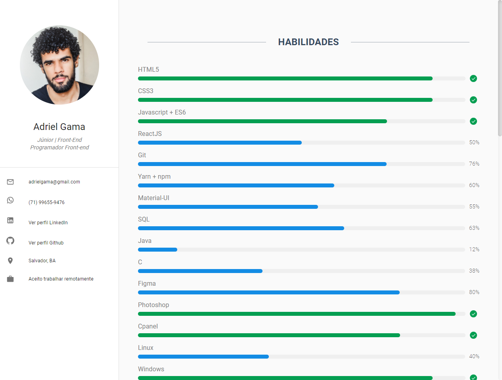
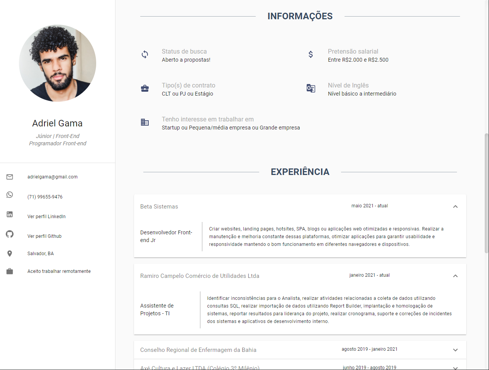

# [New folder project CLICK HERE](https://github.com/adrielgama/adrielgama.github.io)

 
 
 
 

## Currículo online - 2021

> Atualização anual do meu currículo online. 
>
> Modelo 2021 com design responsivo e utilizando o design mais limpo possível.

 

#
## Preview 
<!--  -->

 

# Projeto desenvolvido em ReactJS

 

## Pacotes utilizados no projeto:
- [clsx]
- [Material-UI]
- [React-Icons]
- [React-Router-DOM]
- [React-Sweet-Progress]

 
 

# Melhorias

  - [ ] Design clean das habilidades
  - [ ] Tema escuro
  - [ ] Galeria / portfolio
  - [ ] Download PDF

 
 

# Licence

The MIT License (MIT)

> Copyright (c) 2021 @adrielgama

Permission is hereby granted, free of charge, to any person obtaining a copy of
this software and associated documentation files (the "Software"), to deal in
the Software without restriction, including without limitation the rights to
use, copy, modify, merge, publish, distribute, sublicense, and/or sell copies of
the Software, and to permit persons to whom the Software is furnished to do so,
subject to the following conditions:

The above copyright notice and this permission notice shall be included in all
copies or substantial portions of the Software.

THE SOFTWARE IS PROVIDED "AS IS", WITHOUT WARRANTY OF ANY KIND, EXPRESS OR
IMPLIED, INCLUDING BUT NOT LIMITED TO THE WARRANTIES OF MERCHANTABILITY, FITNESS
FOR A PARTICULAR PURPOSE AND NONINFRINGEMENT. IN NO EVENT SHALL THE AUTHORS OR
COPYRIGHT HOLDERS BE LIABLE FOR ANY CLAIM, DAMAGES OR OTHER LIABILITY, WHETHER
IN AN ACTION OF CONTRACT, TORT OR OTHERWISE, ARISING FROM, OUT OF OR IN
CONNECTION WITH THE SOFTWARE OR THE USE OR OTHER DEALINGS IN THE SOFTWARE.

 [clsx]: <https://github.com/lukeed/clsx>
 [Material-UI]: <https://material-ui.com/>
 [React-Router-DOM]: <https://github.com/ReactTraining/react-router>
 [React-Icons]: <https://react-icons.github.io/react-icons/>
 [React-Sweet-Progress]: <https://github.com/abraztsov/react-sweet-progress>

 [Project Screen Recorder]: <https://youtu.be/XjA_pgY0QQY>
    
